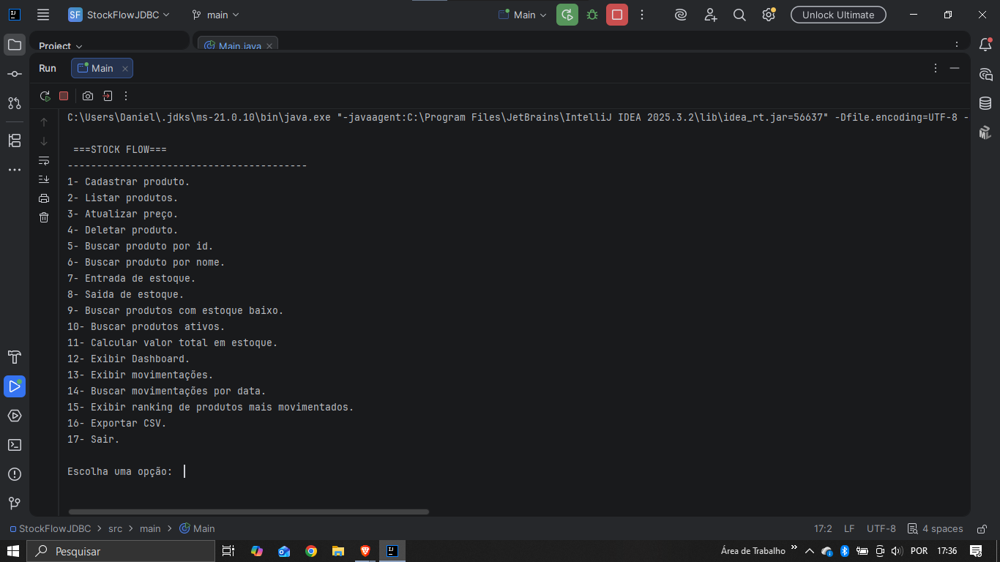
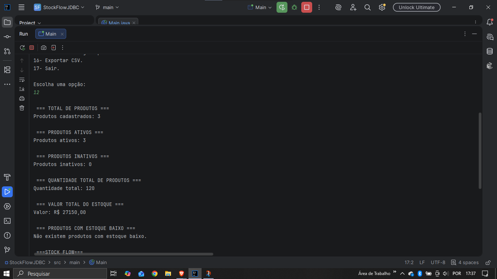
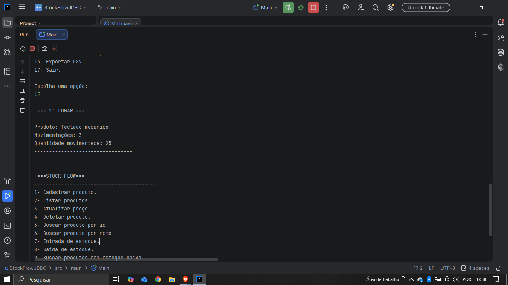

# StockFlow

Sistema de gerenciamento de estoque desenvolvido em Java utilizando JDBC e MySQL.

## Sobre o Projeto

O StockFlow foi criado com o objetivo de aplicar conceitos de Programação Orientada a Objetos, JDBC, SQL e arquitetura em camadas em um projeto prático de controle de estoque.

A aplicação permite cadastrar produtos, controlar entradas e saídas de estoque, registrar movimentações, gerar relatórios e exportar dados para CSV.

## Funcionalidades

### Produtos

* Cadastro de produtos
* Listagem de produtos
* Atualização de preços
* Exclusão de produtos
* Busca por ID
* Busca por nome

### Estoque

* Entrada de estoque
* Saída de estoque
* Validação de estoque insuficiente
* Identificação de produtos com estoque baixo

### Movimentações

* Registro automático de movimentações
* Histórico completo de movimentações
* Consulta de movimentações por período

### Relatórios

* Dashboard com indicadores
* Ranking de produtos mais movimentados
* Exportação de dados para CSV

## Tecnologias Utilizadas

* Java 21
* JDBC
* MySQL
* IntelliJ IDEA
* Git
* GitHub

## Arquitetura

O projeto foi organizado utilizando arquitetura em camadas:

```text
src/
├── model
├── dao
├── service
├── ui
├── util
├── db
└── main
```

### Responsabilidades das Camadas

* Model: entidades do sistema
* DAO: acesso ao banco de dados
* Service: regras de negócio
* UI: interação com o usuário
* Util: funcionalidades auxiliares
* DB: gerenciamento de conexão

## Recursos SQL Utilizados

* SELECT
* INSERT
* UPDATE
* DELETE
* INNER JOIN
* COUNT()
* SUM()
* GROUP BY
* ORDER BY
* BETWEEN

## Funcionalidades Implementadas

* Controle de estoque
* Histórico de movimentações
* Dashboard gerencial
* Relatórios analíticos
* Exportação CSV
* Tratamento de exceções
* Validações de regras de negócio

## Aprendizados Aplicados

* Programação Orientada a Objetos
* Encapsulamento
* Arquitetura em Camadas
* JDBC
* SQL
* Collections
* Manipulação de Arquivos
* Tratamento de Exceções

## Capturas de Tela

### Menu Principal



### Dashboard



### Ranking de Produtos



## Autor

Daniel Santos Oliveira

GitHub:
https://github.com/danielsantosoliveira800-hue
